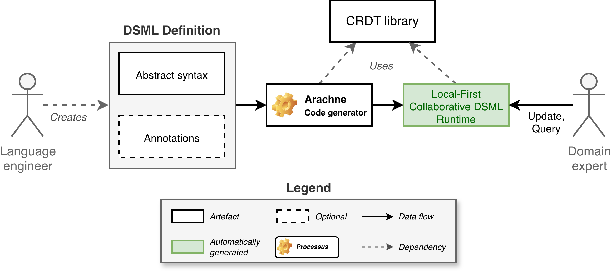
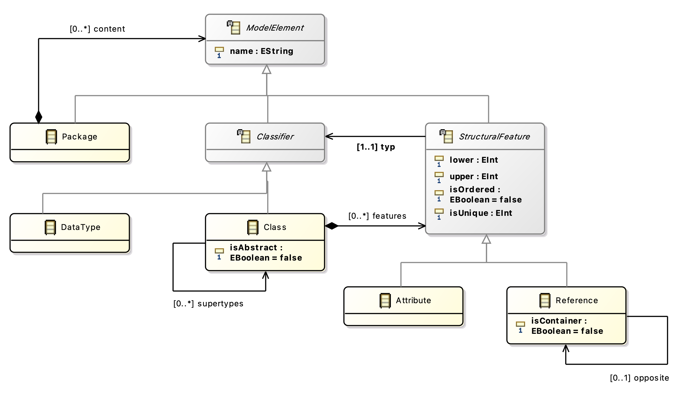
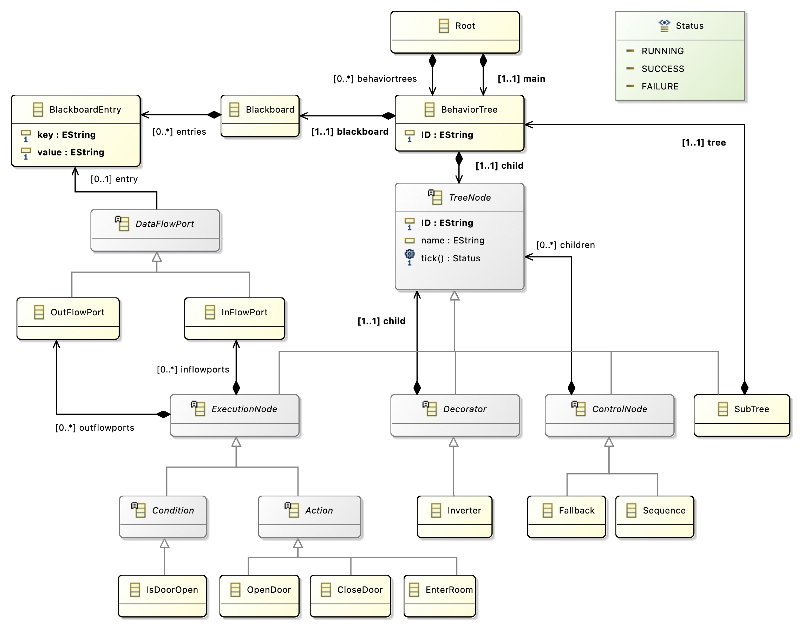
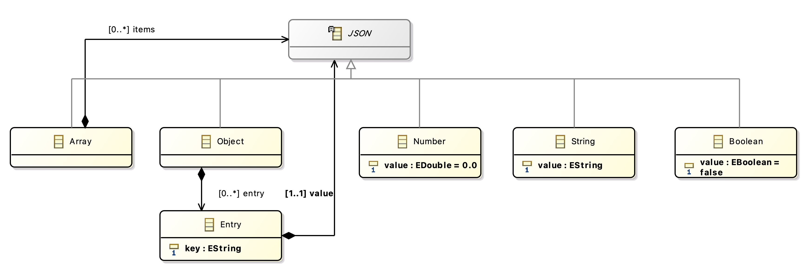

# Arachne

**Arachne** is a Rust-based code generator that compiles Domain-Specific Modeling Languages (DSMLs) defined with Ecore metamodels into Conflict-free Replicated Data Types (CRDTs), leveraging the [Moirai library](https://github.com/CEA-LIST/Moirai).

_Note: Arachne does not aim to support the full Ecore language at this stage; instead, it focuses on the essential features needed to express practical metamodels. Read [Supported features](./arachne-codegen/README.md) for more information._

## Overview

### Motivation

Expressing instances of a recurring problem as sentences in a small, Domain-Specific Language (DSL) is a well-established software engineering technique for simplifying the development and maintenance of business applications.

In the Model-Driven Engineering (MDE) community, metamodels are used to specify the abstract syntax of DSLs in terms of domain concepts, properties, and relationships. Although modern language workbenches can generate much of the language infrastructure (e.g., APIs, (de)serialization, and editors) from a metamodel, support for collaborative model editing is typically delegated to external services, requiring additional integration effort from language engineers. In particular, local-first collaborative modeling, where modelers can seamlessly alternate between online and offline editing, with automatic reconciliation of changes upon reconnection, is poorly supported.

This lack of support is particularly problematic for DSMLs that are used in distributed systems, where modelers may be geographically dispersed and have limited or intermittent network connectivity. In such scenarios, local-first collaborative modeling is essential for enabling effective collaboration and ensuring that all modelers can contribute to the development of the system, regardless of their location or network conditions.

### Our approach

Arachne addresses this problem by automatically generating local-first, decentralized, collaborative runtimes for modeling languages directly from their specifications. The generated runtimes are built on top of CRDTs, which provide a principled approach to achieving eventual consistency in distributed systems. By leveraging CRDTs, Arachne enables modelers to work collaboratively on models without the need for a central server or complex synchronization protocols.

A metamodel is compiled into a composition of pure operation-based CRDTs that mirrors the structure of the metamodel. The generated runtimes support standard object-oriented metamodeling constructs, including objects, attributes, containment hierarchies, references, multiplicities, and subtyping.



### Generated runtime capabilities

The generated runtimes provide an API for creating, reading, updating, and deleting model elements. The generated runtimes also support serialization and deserialization of models, enabling modelers to persist their work and share it with others. However, we do not provide a graphical editor for the generated runtimes.

The generated runtimes implement a [Reliable Causal Broadcast (RCB) protocol](https://courses.edx.org/asset-v1:KTHx+ID2203.2x+2016T4+type@asset+block/Lecture_6_Causal_Broadcast.pdf), which ensures that operations are delivered in a causally consistent order, even in the presence of network partitions and failures. However, we do not provide a network layer for communicating changes between replicas over the network. Instead, we provide a simple API for sending and receiving operations, which can be integrated with any transport layer of the user's choice.

#### Usage example

You can programmatically create one or several replicas of a generated CRDT, and then perform operations on the replicas. Schematically, the usage of a generated CRDT can be represented as follows:

```rust
// Create two replicas of the generated CRDT, each with a unique identifier and a list of replicas it can communicate with.
let mut replica_a = Replica::<MyGeneratedCRDT>::bootstrap("a", &["a", "b"]);
let mut replica_b = Replica::<MyGeneratedCRDT>::bootstrap("b", &["a", "b"]);

// Perform an operation on replica A
let event_a = replica_a.send(MyGeneratedCRDT::SomeOperation { /* ... */ });
// Read the current state of replica A
let returned_value_a = replica_a.query(Read::new());

// B receives the operation from A and applies it to its local state
replica_b.receive(event_a);
// Read the current state of replica B
let returned_value_b = replica_b.query(Read::new());

// A and B have delivered the same operations in a causally consistent order, and thus have converged to the same state.
assert_eq!(returned_value_a, returned_value_b);
```

## Project Organization

- `arachne-parser`: an Ecore-to-Rust parser, forked from `ecore.rs`. [Parser README](./arachne-parser/README.md).
- `arachne-codegen`: core component that generates a composition of CRDTs from a parsed Ecore metamodel. [Codegen README](./arachne-codegen/README.md).
- `arachne-cli`: Command Line Interface tool to run the generator on a given Ecore metamodel. [CLI README](./arachne-cli/README.md).

## Running the generator

Rust must be installed on your machine: <https://rust-lang.org/tools/install>:

```sh
curl --proto '=https' --tlsv1.2 -sSf https://sh.rustup.rs | sh
```

To run the generator, use the following command:

```sh
RUST_LOG=debug cargo run generate -vv -o <WHERE_TO_GENERATE_PROJECT> <PATH_TO_ECORE_METAMODEL>
```

## Testing the generator on ModelSet

[ModelSet](https://github.com/modelset/modelset-dataset) is a dataset of +5,000 Ecore and UML models. We provide a simple Python script (`./modelset_coverage.py`) to automatically pass the models from ModelSet into Arachne to assess its capabilities. For each model, the script if 1. the model was correctly parsed, 2. the model was correctly generated by Arachne, and 3. the generated code compiles.

_Note: because Arachne currently supports only a subset of Ecore, many models will fail to be parsed or generated. The script will report the number of models that were successfully processed. 1,500+ models over ~5,000 are successfully processed currently._

```sh
modelset_coverage.py <PATH_TO_MODELSET> <OPTIONAL_ARGS>

# modelset_coverage.py [-h] [--parse-timeout PARSE_TIMEOUT] [--generate-timeout GENERATE_TIMEOUT] [--compile-timeout COMPILE_TIMEOUT] [--keep-failures] [--show-failures SHOW_FAILURES] [--max-error-chars MAX_ERROR_CHARS] [--skip-cargo-clean] [--limit LIMIT] [--offset OFFSET] [root]
```

### Examples

The repository contains a few example Ecore metamodels in the `examples` folder. You can run the generator on these examples as follows:

[`class_hierarchy.ecore`](./examples/class_hierarchy.ecore) is a simplified UML metamodel that describes a class hierarchy with attributes, references, features, and inheritance.

```sh
RUST_LOG=debug cargo run generate -vv -o ../class_hierarchy ./examples/class_hierarchy.ecore
```



[`behavior_tree.ecore`](./examples/behavior_tree.ecore) is the metamodel of a [Behavior Tree](https://www.behaviortree.dev/), a hierarchical model used in AI for decision-making and control flow.

```sh
RUST_LOG=debug cargo run generate -vv -o ../behavior_tree ./examples/behavior_tree.ecore
```



Finally, [`json.ecore`](./examples/json.ecore) is a metamodel that describes the structure of [JSON data](https://www.json.org/json-en.html).

```sh
RUST_LOG=debug cargo run generate -vv -o ../json ./examples/json.ecore
```


