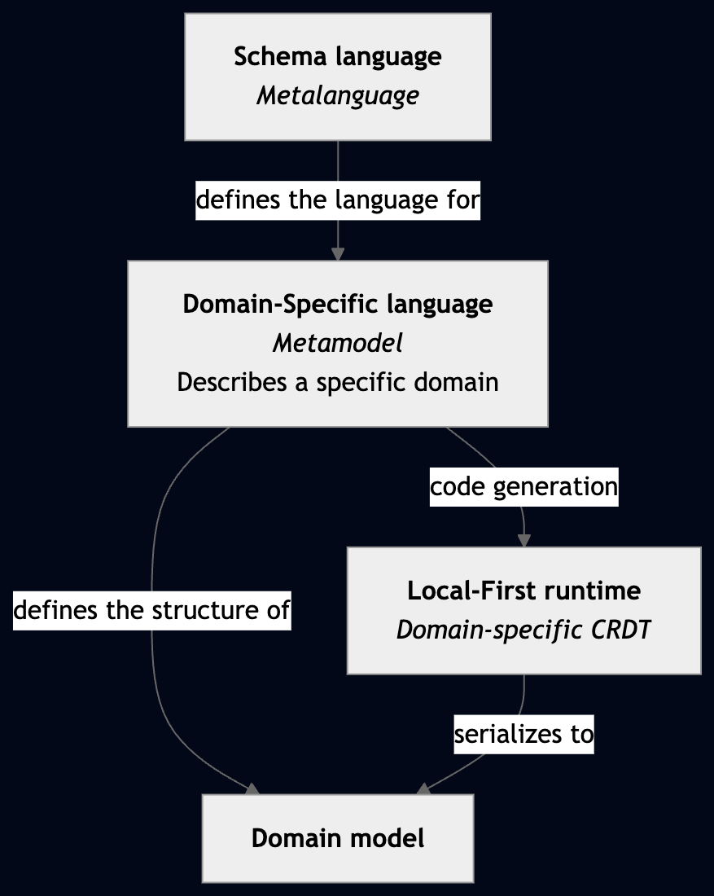
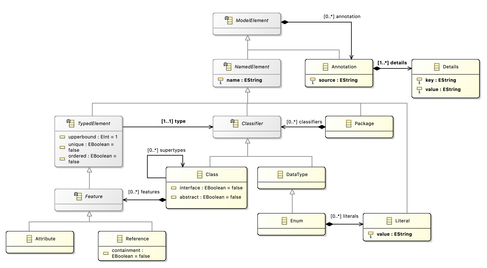

# Arachne Codegen

This is the core component of Arachne, responsible for generating a composition of CRDTs from a parsed Ecore metamodel. Note that the code generator must deal with challenges arising both from the semantics of CRDTs, the semantics of Ecore, and the limitations of Rust, which is the implementation language of the generated code.

For example, while it is not a challenge in itself from a CRDT or Ecore semantics perspective, the fact that Rust does not support feature inheritance (e.g., a struct cannot inherit fields from another struct) requires the code generator to flatten features into each concrete subclass during generation.

## Mapping validity

We outline the principles that guided the design of the mapping from Ecore to CRDTs.

1. Every valid model conforming to the metamodel can be constructed from the generated CRDT.
2. Every sequential execution produces only valid models.
3. The mapping preserves the metamodel's structural decomposition as much as possible (e.g., classes become replicated objects, attributes become replicated fields, etc...).

Depending on the chosen CRDTs during generation (the default mapping can be overridden using EAnnotations), the generated CRDT may allow some invalid models to be constructed, when conflicts arise between concurrent updates. For example, a single-valued attribute may be concurrently set to two different values, and the generated CRDT may resolve the conflict by keeping both values (this is the semantics of the Multi-value Register CRDT). In this case, the generated CRDT would allow a model to be constructed that violates the metamodel's multiplicity constraints. This is a trade-off between conflict-resolution in practical collaborative editing and strict enforcement of metamodel constraints.

## Supported metalanguage

For detailed Ecore documentation, see: [Ecore API Documentation](https://download.eclipse.org/modeling/emf/emf/javadoc/2.9.0/org/eclipse/emf/ecore/package-summary.html#details)

The schema language is the metalanguage understood by the code generator. It corresponds to a restricted subset of Ecore in which domain-specific metamodels are expressed. A metamodel defines the structure of valid domain models and is used by the generator to produce a domain-specific local-first runtime, implemented as a CRDT. Runtime instances can then be edited locally without coordination and replicated opportunistically, while preserving the structure prescribed by the metamodel, and can be serialized back into the standard Ecore model representation.



The Arachne recognized metalanguage:



## Mapping Reference

The generator accepts Ecore files as input, but it only supports a strict subset of the Ecore metalanguage. As a result, unsupported Ecore features may be ignored during code generation.

### Package

A `EPackage` is supported as an object holding all the generated collaborative metamodel. Interaction between packages is not currently supported. Only the first package encountered will be generated.

### Classifiers

| Ecore       | CRDT                                              |
| ----------- | ------------------------------------------------- |
| `EDataType` | See [Primitive Data Types](#primitive-data-types) |
| `EClass`    | See [`EClass`](#eclass)                           |
| `EEnum`     | Rust enum + any `Register`                        |

Generated Rust enums implement `Debug`, `Clone`, `PartialEq`, `Eq`, `PartialOrd`, `Ord`, `Hash`, `Default` (first variant).

### Primitive Data Types

| Ecore      | CRDT                                                       |
| ---------- | ---------------------------------------------------------- |
| `EByte`    | `Counter<i8>` or any `Register`                            |
| `EShort`   | `Counter<i16>` or any `Register`                           |
| `EInt`     | `Counter<i32>` or any `Register`                           |
| `ELong`    | `Counter<i64>` or any `Register`                           |
| `EFloat`   | `Counter<f32>` or any `Register`                           |
| `EDouble`  | `Counter<f64>` or any `Register`                           |
| `EBoolean` | `Enable-Wins Flag`, `Disable-Wins Flag`, or any `Register` |
| `EChar`    | Any `Register`                                             |
| `EString`  | `List<String>` or any `Register`                           |

#### `EClass`

A (concrete) `EClass` is generated as a `record`.

##### Abstract class

For abstract classes, the code generator does not produce an abstract type in the target language. Instead, it replaces abstract classes with a closed `union` type that represents all their concrete subclasses. This union type preserves subtyping by allowing any concrete subclass to be used wherever the abstract type is expected. Features defined in the abstract class are not inherited at runtime but are statically flattened into each concrete subclass during generation, so that each generated class explicitly contains all required properties.

This approach eliminates runtime inheritance while preserving substitutability and structural reuse, and it is well suited to a closed-world setting where all concrete variants are known at generation time.

Orphan abstract classes, i.e., that are inherited by no concrete classes, are not supported.

##### Interface

Operations are not supported. See [Operations](#operations). Features are statically flattened into each concrete subclass that implement the interface during generation.

### Typed elements

| Ecore        | Meaning                                              | Implemented? | Notes                                                |
| ------------ | ---------------------------------------------------- | ------------ | ---------------------------------------------------- |
| `ordered`    | If `true`, the feature is ordered (i.e., is a list). | Yes.         |                                                      |
| `unique`     | Every element is unique (i.e., is a set).            | Yes.         | Implemented as a Set if it is a primitive data type. |
| `lowerbound` |                                                      | Yes.         | see [Bounds](#bounds)                                |
| `upperbound` |                                                      | Yes.         | see [Bounds](#bounds)                                |

| Ecore                                                 | CRDT                                                                                                      |
| ----------------------------------------------------- | --------------------------------------------------------------------------------------------------------- |
| `ordered = true`, `unique = true`, `upperbound > 1`   | Theorethically it should be `UniqueList` CRDT, but we don't have such CRDT yet. It is a Sequence instead. |
| `ordered = false`, `unique = false`, `upperbound > 1` | `Bag` (Of non-mutable elements!)                                                                          |
| `ordered = true`, `unique = false`, `upperbound > 1`  | `List`                                                                                                    |
| `ordered = false`, `unique = true`, `upperbound > 1`  | `Set` (Of non-mutable elements!)                                                                          |

#### Bounds

| Ecore  | CRDT        |
| ------ | ----------- |
| `0..1` | `Option<T>` |
| `1`    | `T`         |
| `0..*` | `List<T>`   |
| `1..*` | ?           |
| `1..n` | ?           |
| `n..*` | ?           |
| `n..m` | ?           |

### Structural features

| Ecore          | Meaning                                                                        | Implemented? | Notes                                                                                                                                                                                                                             |
| -------------- | ------------------------------------------------------------------------------ | ------------ | --------------------------------------------------------------------------------------------------------------------------------------------------------------------------------------------------------------------------------- |
| `changeable`   | If `false`, then the feature is immutable.                                     | No.          | Could be implemented by generating the Rust struct of an object rather than using a CRDT. In the case of a reference towards a non-changeable reference, it would mean that the element cannot be updates through this reference? |
| `volatile`     | If `true`, the value is computed on access and never stored                    | No.          |                                                                                                                                                                                                                                   |
| `derived`      | If `true`, the value is computed from other features.                          | No.          |                                                                                                                                                                                                                                   |
| `transient`    | If `true`, the value is not serialized.                                        | No.          |                                                                                                                                                                                                                                   |
| `unsettable`   | If `true`, the feature distinguish between "unset" and "set to default value". | No.          | May be implemented depending on the CRDT.                                                                                                                                                                                         |
| `defaultValue` | The feature has a default value.                                               | No.          | Could be implemented.                                                                                                                                                                                                             |

#### Reference

A reference from an object A to another object B is materialized by an arc between the identifier of these objects in the `ReferenceManager`.

- `containment`: the reference owns the referenced `EClass`. The generated object has a field owning the referenced object.
- `container`: the reference points to the parent `EClass`. Not supported.

### Operations

The code generator intentionally does not support Ecore operations at this stage. This decision is primarily motivated by the semantic constraints of conflict-free replicated data types (CRDTs) and by limitations of the Ecore metamodel.

- First, the implementation of operations is not specified in Ecore, which means a code generator cannot automatically derive their semantics in a meaningful or correct way. Generating operation signatures without being able to generate their behavior would therefore provide little practical value.
- Second, Ecore does not distinguish between _pure queries_ (side-effect free operations that return a value) and _updates_ (operations with side effects). This distinction is essential in the context of CRDTs, since the underlying CRDT runtime only supports pure operations and a fixed, explicit set of update operations. Allowing users to implement operations manually would risk introducing side effects or updates that are incompatible with the CRDT's convergence guarantees.
- Third, the CRDT interface exposes a closed set of available updates. Extending this set is not a local change: it typically requires extending the CRDT's semantics. Supporting such extensions in generated code would therefore be complex and error-prone, and is precisely one of the reasons for developing a specialized code generator in the first place.
- While adding new pure queries is conceptually simpler, queries in CRDTs are evaluated over a partially ordered set of updates to compute a deterministic value. For the same reasons as above, the generator should not require users to manually implement queries whose correctness depends on the CRDT's semantics.

An exception is made for queries on values derived from the CRDT state. For example, a `read()` operation may project the CRDT state into a deterministic value (such as a Behavior Tree), and pure query operations can then be defined on this projected value. Since these queries operate on a stable, materialized representation and do not affect the CRDT's semantics, they can be supported safely.

### Management of References

An important challenge in generating code from a metamodel into a composition of CRDTs is the management of references. The approach to CRDT composition and nesting proposed by _Bauwens et al._ is hierarchical: a parent CRDT can propagate its conflict-resolution policy to its children using a causal reset. However, references represent relationships between siblings in the hierarchy.

An auxiliary, specialized _typed graph CRDT_, called the `ReferenceManager`, is responsible for registering references between classifiers. This CRDT encodes which classes may reference which other classes, the hierarchy between classes (which class is children of another) together with the associated multiplicity constraints (upper and lower bounds). When interpreting the state of the model, elements are first evaluated independently; the links between them are then established by reading and applying the state of the `ReferenceManager`.

## Customizing the Code Generator Mapping

The Ecore metamodeling language allows annotating model elements with `EAnnotation`s. A language engineer can use them to give hints to the code generator on the kind of replicated data type it wants to be used for specific model elements.

### Supported Annotation Sources

- `urn:arachne:semantics`
  Used on structural features to override the generated CRDT mapping.
- `urn:arachne:representation`
  Used on concrete `EClass`es to project wrapper classes into transparent union variants.

### `urn:arachne:semantics`

#### `datatype`

`datatype` can be attached to an `EAttribute` or, in some cases, to a containment `EReference`.

Supported values:

- `resettable-counter`
- `ew-flag`
- `dw-flag`
- `mv-register`
- `lww-register`
- `fair-register`
- `po-register` or `partial-order-register`
- `to-register` or `total-order-register`
- `list`
- `aw-set`
- `rw-set`
- `uw-map`

Example on an attribute:

```xml
<eStructuralFeatures xsi:type="ecore:EAttribute" name="status" lowerBound="1"
    eType="ecore:EDataType http://www.eclipse.org/emf/2002/Ecore#//EString">
    <eAnnotations source="urn:arachne:semantics">
        <details key="datatype" value="lww-register"/>
    </eAnnotations>
</eStructuralFeatures>
```

#### `uw-map` on a containment reference

`uw-map` is used on a multi-valued containment `EReference` whose target class acts as a map entry carrier. The target class must expose:

- one single-valued `EAttribute` used as the key,
- one single-valued feature used as the value,
- the value feature must not be a non-containment reference.

The key and value features default to `key` and `value`, but can be customized.

```xml
<eStructuralFeatures xsi:type="ecore:EReference" name="entries" upperBound="-1"
    eType="#//Entry" containment="true">
    <eAnnotations source="urn:arachne:semantics">
        <details key="datatype" value="uw-map"/>
        <details key="key-feature" value="key"/>
        <details key="value-feature" value="value"/>
    </eAnnotations>
</eStructuralFeatures>
```

### `urn:arachne:representation`

When concrete subclasses are annotated with `urn:arachne:representation` / `kind=transparent`, the union variant payload is generated directly from the selected field and the wrapper subclass record is omitted.

#### Transparent wrapper projection

Concrete subclasses of an abstract class can be projected directly into the generated union payload instead of producing a wrapper `record!`.

Use:

```xml
<eAnnotations source="urn:arachne:representation">
    <details key="kind" value="transparent"/>
    <details key="field" value="value"/>
</eAnnotations>
```

The `field` must name the structural feature whose generated CRDT/log pair should become the union variant payload.

This is especially useful for algebraic datatypes such as JSON.

Example:

```xml
<eClassifiers xsi:type="ecore:EClass" name="String" eSuperTypes="#//Json">
    <eAnnotations source="urn:arachne:representation">
        <details key="kind" value="transparent"/>
        <details key="field" value="value"/>
    </eAnnotations>
    <eStructuralFeatures xsi:type="ecore:EAttribute" name="value" lowerBound="1"
        eType="ecore:EDataType http://www.eclipse.org/emf/2002/Ecore#//EString" />
</eClassifiers>
```

When all concrete top-level variants of an abstract root are transparent, the package root is generated from the abstract union rather than from one concrete variant.

## To-Do

Keeping track of the current state of the code generator, here is a list of features that are either implemented or still missing:

- [x] EAnnotations support for datatype overrides
- [x] Transparent representation annotations
- [x] Reference manager
- [ ] Multiple EPackages
- [ ] Fuzzer impl
- [ ] Parser: defaultValue, defaultValueLiteral, generic type panic, resolveProxies
- [ ] _unexpected `cfg` condition value: `test_utils`_: decide whose feature flag controls the generated code
- [x] Reserved Rust keywords
- [ ] Macro generated struct names clash with user-defined metamodel constructs
