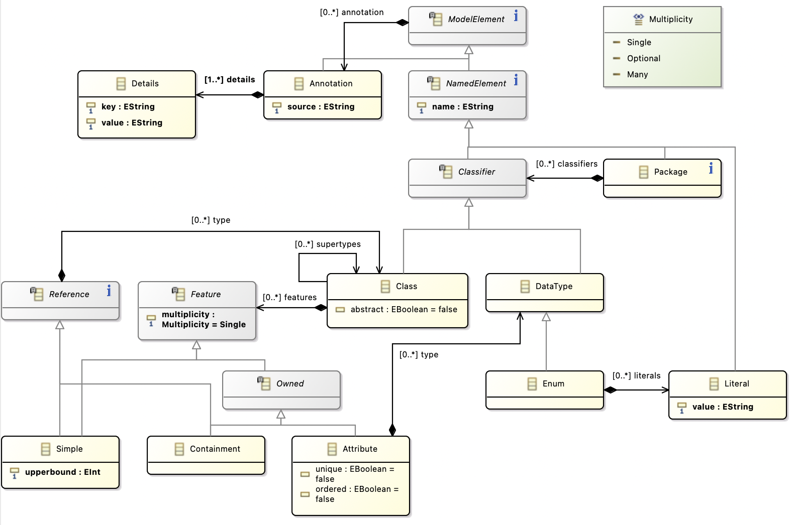

# Arachne Codegen

This is the core component of Arachne, responsible for generating a composition of CRDTs from a parsed Ecore metamodel. Note that the code generator must deal with challenges arising both from the semantics of CRDTs, the semantics of Ecore, and the limitations of Rust, which is the implementation language of the generated code.

For example, while it is not a challenge in itself from a CRDT or Ecore semantics perspective, the fact that Rust does not support feature inheritance (e.g., a struct cannot inherit fields from another struct) requires the code generator to encode inherited features explicitly. A generated subclass stores one log field per direct superclass or interface, such as `abstract_super: AbstractLog`, rather than relying on runtime inheritance.

_Note: we assume the reader is familiar with the concepts of CRDTs and Ecore. For an introduction to CRDTs, see [Approaches to Conflict-Free Replicated Data Types](https://dl.acm.org/doi/10.1145/3695249). Our implementation is based on the [pure operation-based CRDTs](https://arxiv.org/abs/1710.04469) framework._

## Mapping validity

We outline the principles that guided the design of the mapping from Ecore to CRDTs. Considering metamodels conforming to the supported subset of Ecore:

1. Every valid model conforming to the metamodel should be constructible from the generated CRDT.
2. Sequential execution of operations should always produce a valid model.
3. The mapping preserves the metamodel's structural decomposition as much as possible: classes become replicated objects, attributes become replicated fields, etc...

Depending on the chosen CRDTs during generation (the default mapping can be overridden using `EAnnotation`s), the generated CRDT may allow some invalid models to be constructed, when conflicts arise between concurrent updates. For example, a single-valued attribute may be concurrently set to two different values, and the generated CRDT may resolve the conflict by keeping both values (this is the semantics of the Multi-value Register CRDT). In this case, the generated CRDT would allow a model to be constructed that violates the metamodel's multiplicity constraints. This is a trade-off between conflict-resolution in practical collaborative editing and strict enforcement of metamodel constraints.

## Supported metalanguage

For detailed Ecore documentation, see: [Ecore API Documentation](https://download.eclipse.org/modeling/emf/emf/javadoc/2.9.0/org/eclipse/emf/ecore/package-summary.html#details)

The schema language is the metalanguage understood by the code generator. It corresponds to a restricted subset of Ecore in which domain-specific metamodels are expressed. A metamodel defines the structure of valid domain models and is used by the generator to produce a domain-specific local-first runtime, implemented as a CRDT. Runtime instances can then be edited locally without coordination and replicated opportunistically while preserving the supported structural constraints prescribed by the metamodel.


The Arachne recognized metalanguage:



## Mapping Reference

The generator accepts Ecore files as input, but it only supports a strict subset of the Ecore metalanguage. As a result, unsupported Ecore features may be ignored during code generation.

### Package

A `EPackage` is supported as an object holding all the generated collaborative metamodel. Interaction between packages is not currently supported. Only the first package encountered will be generated.

### Classifiers

| Ecore       | Generated representation                                                      |
| ----------- | ----------------------------------------------------------------------------- |
| `EDataType` | See [Primitive Data Types](#primitive-data-types)                             |
| `EClass`    | See [`EClass`](#eclass)                                                       |
| `EEnum`     | Rust enum. Attributes typed by the enum use a replicated register by default. |

Generated Rust enums implement `Debug`, `Clone`, `PartialEq`, `Eq`, `PartialOrd`, `Ord`, `Hash`, `Default` (first variant).

### Primitive Data Types

For a required single-valued `EAttribute`, the default primitive mapping is:

| Ecore      | Default generated CRDT |
| ---------- | ---------------------- |
| `EByte`    | `Counter<i8>`          |
| `EShort`   | `Counter<i16>`         |
| `EInt`     | `Counter<i32>`         |
| `ELong`    | `Counter<i64>`         |
| `EFloat`   | `Counter<f32>`         |
| `EDouble`  | `Counter<f64>`         |
| `EBoolean` | `EWFlag`               |
| `EChar`    | `MVRegister<char>`     |
| `EString`  | `List<char>`           |

Optional attributes wrap the CRDT log in `OptionLog`; multi-valued attributes use the collection mapping described in [Typed elements](#typed-elements). The `datatype` annotation can override some primitive mappings; see [`urn:arachne:semantics`](#urnarachnesemantics).

#### `EClass`

A (concrete) `EClass` is generated as a `record`.

##### Abstract class

Abstract classes provide both subtyping and structural reuse. Because our CRDT implementation language, Rust, does not support runtime structural inheritance, features declared in an abstract class are not inherited directly. Instead, each concrete subclass stores an explicit superclass log field, for example `abstract_super: AbstractLog`.

Subtyping in a distributed setting may cause conflicts when concurrent updates select different concrete subclasses. We handle this with a dedicated Union CRDT. For each abstract class, the generator creates a closed union family over its concrete subclasses: each subclass becomes a union variant, and the Union CRDT resolves conflicts between concurrent updates to different variants.

This removes runtime inheritance while preserving substitutability and shared structure. The approach fits a closed-world generation model, where all concrete variants are known in advance.

Orphan abstract classes, meaning abstract classes with no instantiable subclasses in the generated package slice, are skipped with a warning.

##### Interface

Operations are not supported (see [Operations](#operations)). Interfaces are generated like abstract classes.

### Typed elements

| Ecore        | Meaning                            | Implemented? | Notes                                                                                                                      |
| ------------ | ---------------------------------- | ------------ | -------------------------------------------------------------------------------------------------------------------------- |
| `ordered`    | If `true`, the feature is ordered. | Partly.      | Used for multi-valued `EAttribute`s. Multi-valued containment references use `NestedListLog` unless annotated as `uw-map`. |
| `unique`     | Every element is unique.           | Partly.      | Used for multi-valued `EAttribute`s. `unique=true, ordered=true` does not enforce uniqueness.                              |
| `lowerBound` | Minimum cardinality.               | Partly.      | See [Bounds](#bounds).                                                                                                     |
| `upperBound` | Maximum cardinality.               | Partly.      | See [Bounds](#bounds).                                                                                                     |

After bounds are normalized, multi-valued `EAttribute`s (`BoundKind::Many`) use this mapping:

| Ecore                           | Generated log                                                                        |
| ------------------------------- | ------------------------------------------------------------------------------------ |
| `ordered=true`, `unique=true`   | `GraphLog<List<T>>`. This is an ordered sequence; uniqueness is not enforced.        |
| `ordered=true`, `unique=false`  | `NestedListLog<L>`, where `L` is the required single-value log for the element type. |
| `ordered=false`, `unique=false` | `AWBagLog<T>`. Elements are plain Rust values, not nested mutable logs.              |
| `ordered=false`, `unique=true`  | `VecLog<AWSet<T>>` by default, or `VecLog<RWSet<T>>` with `datatype=rw-set`.         |

For containment `EReference`s, the mapping is independent of `ordered` and `unique`: single-valued containment maps to the child log, optional containment maps to `OptionLog<ChildLog>`, and multi-valued containment maps to `NestedListLog<ChildLog>` unless annotated as `uw-map`. Cyclic containment paths may box the child log to keep generated Rust types finite. Non-containment references are not generated as fields; they are stored in the `ReferenceManager`.

#### Bounds

Bounds are normalized before most structural-feature mappings. If no `lowerBound` is specified, the parser currently defaults it to `0`. If no `upperBound` is specified, Ecore's default upper bound is parsed as `1`.

| Ecore bounds           | Generated shape                                                                                                    |
| ---------------------- | ------------------------------------------------------------------------------------------------------------------ |
| `0..1`                 | Optional: `OptionLog<T>` for nested logs, or package-specific optional field mapping.                              |
| `1..1`                 | Single value: `T`.                                                                                                 |
| `0..*`                 | Many values. The concrete CRDT depends on whether the feature is an attribute, containment reference, or `uw-map`. |
| `0..0`                 | Normalized to `0..1` with a warning.                                                                               |
| `0..n`, `n > 1`        | Normalized to `0..*` with a warning.                                                                               |
| `1..*`                 | Normalized to `0..*` with a warning for containment and attribute mappings.                                        |
| `1..n`, `n..*`, `n..m` | Normalized to `0..*` with a warning for containment and attribute mappings.                                        |

Non-containment reference bounds are not normalized by this helper. Their parsed lower and upper bounds are passed directly to the generated typed graph edge declarations. Other unsupported bounds are not enforced beyond the best-effort normalization above.

### Structural features

| Ecore          | Meaning                                                                          | Implemented? | Notes                                                  |
| -------------- | -------------------------------------------------------------------------------- | ------------ | ------------------------------------------------------ |
| `changeable`   | If `false`, then the feature is immutable.                                       | No.          | Ignored with a warning when explicitly set to `false`. |
| `volatile`     | If `true`, the value is computed on access and never stored.                     | No.          | Ignored with a warning when present.                   |
| `derived`      | If `true`, the value is computed from other features.                            | No.          | Ignored with a warning when present.                   |
| `transient`    | If `true`, the value is not serialized.                                          | No.          | Ignored with a warning when present.                   |
| `unsettable`   | If `true`, the feature distinguishes between "unset" and "set to default value". | No.          | Ignored with a warning when present.                   |
| `defaultValue` | The feature has a default value.                                                 | No.          | Not currently parsed into the generated mapping.       |

#### Reference

Containment and non-containment references are mapped differently.

- `containment=true`: the reference owns the referenced `EClass`. The generated object has a field owning the referenced object log. Bounds map to single, `OptionLog`, or `NestedListLog`, except for `uw-map`.
- `containment=false`: the reference is materialized by an arc between object identifiers in the generated `ReferenceManager`. References typed by abstract classes, interfaces, or concrete classes with subclasses are projected to instantiable source/target class combinations.
- `container`: the reference points to the parent `EClass`. Not supported.

Only references whose instantiable source and target classes are part of the generated reachable package slice are represented. References to classes outside that slice are skipped with a warning.

### Operations

The code generator intentionally does not support Ecore operations at this stage. Every `EOperation` is skipped during generation and reported as a warning. This decision is primarily motivated by the semantic constraints of CRDTs and by limitations of the Ecore metamodel.

- First, the implementation of operations is not specified in Ecore, which means a code generator cannot automatically derive their semantics in a meaningful or correct way. Generating operation signatures without being able to generate their behavior would therefore provide little practical value.
- Second, Ecore does not distinguish between _pure queries_ (side-effect free operations that return a value) and _updates_ (operations with side effects). This distinction is essential in the context of CRDTs, since the underlying CRDT runtime only supports pure operations and a fixed, explicit set of update operations. Allowing users to implement operations manually would risk introducing side effects or updates that are incompatible with the CRDT's convergence guarantees.
- Third, the CRDT interface exposes a closed set of available updates. Extending this set is not a local change: it typically requires extending the CRDT's semantics. Supporting such extensions in generated code would therefore be complex and error-prone, and is precisely one of the reasons for developing a specialized code generator in the first place.
- While adding new pure queries is conceptually simpler, queries in CRDTs are evaluated over a partially ordered set of updates to compute a deterministic value. For the same reasons as above, the generator should not require users to manually implement queries whose correctness depends on the CRDT's semantics.

An exception is made for queries on values derived from the CRDT state. For example, a `read()` operation may project the CRDT state into a deterministic value (such as a Behavior Tree), and pure query operations can then be defined on this projected value. Since these queries operate on a stable, materialized representation and do not affect the CRDT's semantics, they could be supported safely in a future version.

### Management of References

An important challenge in generating code from a metamodel into a composition of CRDTs is the management of references. The approach to CRDT composition and nesting proposed by _Bauwens et al._ is hierarchical: a parent CRDT can propagate its conflict-resolution policy to its children using a causal reset. However, references represent relationships between siblings in the hierarchy.

An auxiliary, specialized _typed graph CRDT_, called the `ReferenceManager`, is responsible for registering non-containment references between classifier instances. The generator expands polymorphic reference types to instantiable source and target class combinations and emits typed graph edge declarations with the parsed reference bounds. Containment ownership is not stored as ordinary reference arcs; it is represented by the nested object path emitted by containment logs and used by the reference manager to create vertices and delete subtrees. When interpreting the state of the model, contained elements are evaluated independently; non-containment links are then established by reading and applying the state of the `ReferenceManager`.

## Customizing the Code Generator Mapping

The Ecore metamodeling language allows annotating model elements with `EAnnotation`s. A language engineer can use them to give hints to the code generator on the kind of replicated data type it wants to be used for specific model elements.

### Supported Annotation Sources

- `urn:arachne:semantics`
  Used on structural features to override the generated CRDT mapping.
- `urn:arachne:representation`
  Used on concrete `EClass`es to project wrapper classes into transparent union variants.

### `urn:arachne:semantics`

#### `datatype`

`datatype` can be attached to an `EAttribute` or, in some cases, to a containment `EReference`. Unknown values are ignored by the mapping helpers.

Supported values for attributes:

- `resettable-counter`
- `ew-flag`
- `dw-flag`
- `mv-register`
- `lww-register`
- `fair-register`
- `po-register` or `partial-order-register`
- `to-register` or `total-order-register`
- `list`
- `aw-set`
- `rw-set`

`aw-set` and `rw-set` only affect multi-valued attributes with `ordered=false` and `unique=true`. `uw-map` is only meaningful on a multi-valued containment reference and is described below.

Example on an attribute:

```xml
<eStructuralFeatures xsi:type="ecore:EAttribute" name="status" lowerBound="1"
    eType="ecore:EDataType http://www.eclipse.org/emf/2002/Ecore#//EString">
    <eAnnotations source="urn:arachne:semantics">
        <details key="datatype" value="lww-register"/>
    </eAnnotations>
</eStructuralFeatures>
```

#### `uw-map` on a containment reference

`uw-map` is used on a multi-valued containment `EReference` whose target class acts as a map entry carrier. The target class must expose:

- one `EAttribute` used as the key,
- one required single-valued feature used as the value,
- the value feature must not be a non-containment reference.

The key and value features default to `key` and `value`, but can be customized. In practice, use `lowerBound=1` and `upperBound=1` on the value feature; non-containment reference values are rejected.

```xml
<eStructuralFeatures xsi:type="ecore:EReference" name="entries" upperBound="-1"
    eType="#//Entry" containment="true">
    <eAnnotations source="urn:arachne:semantics">
        <details key="datatype" value="uw-map"/>
        <details key="key-feature" value="key"/>
        <details key="value-feature" value="value"/>
    </eAnnotations>
</eStructuralFeatures>
```

### `urn:arachne:representation`

When concrete subclasses in a generated union family are annotated with `urn:arachne:representation` / `kind=transparent`, the union variant payload is generated directly from the selected field and the wrapper subclass record is omitted.

#### Transparent wrapper projection

Concrete subclasses of an abstract/interface class, or of a concrete class that itself has subclasses, can be projected directly into the generated union payload instead of producing a wrapper `record!`.

Use:

```xml
<eAnnotations source="urn:arachne:representation">
    <details key="kind" value="transparent"/>
    <details key="field" value="value"/>
</eAnnotations>
```

The `field` must name the structural feature whose generated payload/log pair should become the union variant payload. For transparent `uw-map` fields, the selected map-entry value must also be single-valued.

This is especially useful for algebraic datatypes such as JSON.

Example:

```xml
<eClassifiers xsi:type="ecore:EClass" name="String" eSuperTypes="#//Json">
    <eAnnotations source="urn:arachne:representation">
        <details key="kind" value="transparent"/>
        <details key="field" value="value"/>
    </eAnnotations>
    <eStructuralFeatures xsi:type="ecore:EAttribute" name="value" lowerBound="1"
        eType="ecore:EDataType http://www.eclipse.org/emf/2002/Ecore#//EString" />
</eClassifiers>
```

When all concrete top-level variants of an abstract root are transparent, the package root is generated from the abstract union rather than from one concrete variant.

## To-Do

Keeping track of the current state of the code generator, here is a list of features that are either implemented or still missing:

- [x] `EAnnotation`s support for datatype overrides
- [x] Transparent representation annotations
- [x] Reference manager
- [ ] Multiple EPackages
- [ ] Fuzzer impl
- [ ] Parser: defaultValue, defaultValueLiteral, generic type panic, resolveProxies
- [ ] _unexpected `cfg` condition value: `test_utils`_: decide whose feature flag controls the generated code
- [x] Reserved Rust keywords
- [x] Macro generated struct names clash with user-defined metamodel constructs
