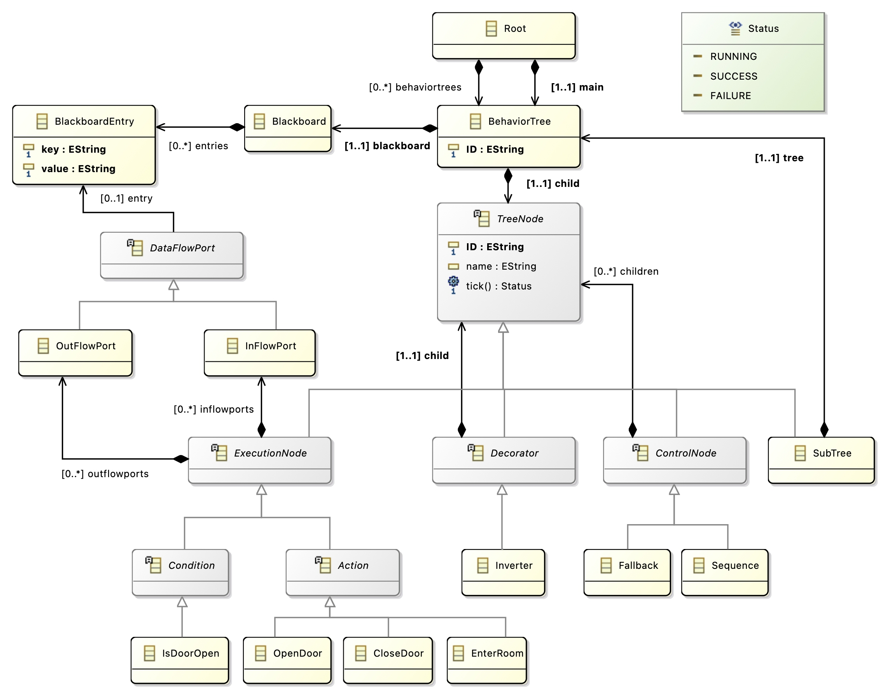
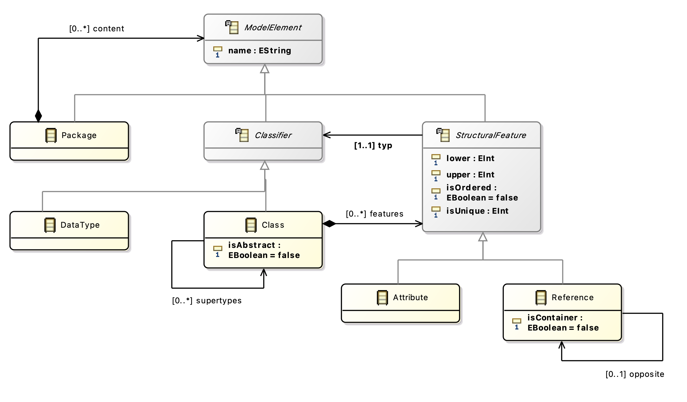
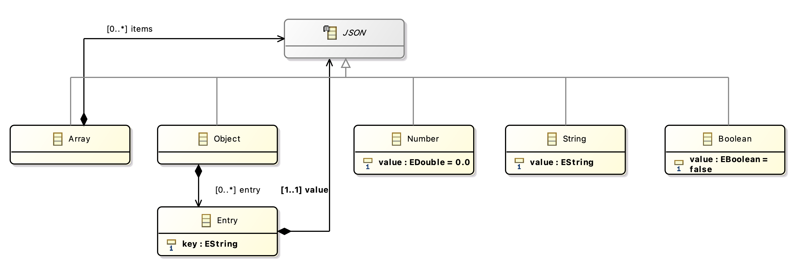

# Examples

## Running the examples

In a POSIX shell:

```sh
RUST_LOG=debug cargo run generate -vv -o <WHERE_TO_GENERATE_PROJECT> <PATH_TO_ECORE_METAMODEL>
```

## Case studies

The `example` folder contains three metamodel case studies that demonstrate the capabilities of the code generator: Class Hierarchy, Behavior Tree, and JSON.

| DSML            | Domain                             | # Model elements                                      | Characteristics                                  |
| --------------- | ---------------------------------- | ----------------------------------------------------- | ------------------------------------------------ |
| Behavior Tree   | Task planning<br>for robotics      | 22 classes (6 abstract),<br>16 features (1 reference) | Inheritance, references,<br>enumerations         |
| Class Hierarchy | Structural modeling<br>of a system | 8 classes (3 abstract),<br>12 features (4 references) | Inheritance, bounds,<br>self-references          |
| JSON            | Structured data<br>exchange        | 7 classes (1 abstract),<br>7 features                 | Inheritance, recursive<br>structure, annotations |

_Table: Overview of the DSML case studies used._

### Metamodel diagrams

#### Behavior Tree



#### Class Hierarchy



#### JSON



## Pet metamodels

We also provide a set of "pet" metamodels ([/pet_metamodels](./pet_metamodels/)) that highlight specific supported features of the code generator.

| Pet                                                                                       | Highlighted feature(s)                                                 |
| ----------------------------------------------------------------------------------------- | ---------------------------------------------------------------------- |
| [abstract_inherits_concrete.ecore](./pet_metamodels/abstract_inherits_concrete.ecore)     | Abstract class inherits from concrete class                            |
| [concrete_inherits_concrete.ecore](./pet_metamodels/concrete_inherits_concrete.ecore)     | Concrete class inherits from concrete class                            |
| [concrete_polymorphic_targets.ecore](./pet_metamodels/concrete_polymorphic_targets.ecore) | References targeting concrete superclass implementations               |
| [ecore_builtins.ecore](./pet_metamodels/ecore_builtins.ecore)                             | Classes extending Ecore's own classes, a reference typed by `EObject` refused |
| [kitchen_sink.ecore](./pet_metamodels/kitchen_sink.ecore)                                 | EDataTypes, bounds, collection semantics, references, abstract classes |
| [multiple_inheritance.ecore](./pet_metamodels/multiple_inheritance.ecore)                 | Multiple inheritance from abstract classes                             |

## The notation metamodel

[`notation.ecore`](./notation.ecore) is not a case study: it is the language the model editor's diagram panel keeps a drawing in, held in the store beside the domain model the drawing depicts. It is shaped after the GMF Runtime notation metamodel (`org.eclipse.gmf.runtime.notation`) as Papyrus writes a `.notation` resource beside a `.uml` one, cut down to a `Diagram` of `Node`s and `Edge`s with `x`/`y`/`width`/`height` and no styles, compartments or bendpoints.

Two things about it are worth reading before it is changed. A `Diagram`'s `element` is the 32-hex id of the model it depicts, which is how an editor pairs the two with nothing recorded on the node; and every coordinate carries `urn:arachne:semantics` `datatype="lww-register"`, because a plain `EInt` derives to a **resettable counter** and two people dragging one box would sum their moves rather than settle on one of them.

`notation.metamodel.json` is `arachne describe notation.ecore`, and `examples/fixtures/metamodel-digests.json` records its identity as it does for the case studies.
