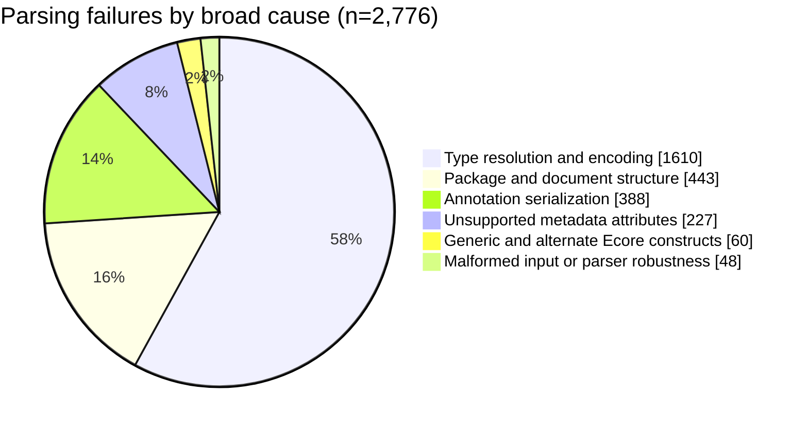
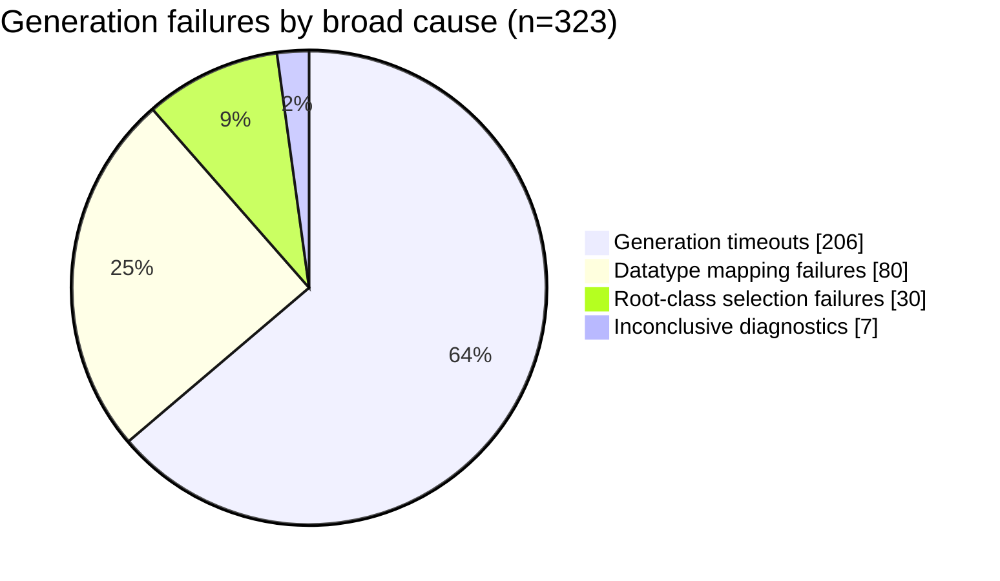

# ModelSet coverage report

Realized with Arachne v0.2.1.

Dataset:
[ModelSet v0.9.4](https://github.com/modelset/modelset-dataset/releases/tag/v0.9.4)

This report summarizes the supplied
[`modelset_coverage.csv`](./modelset_coverage.csv). The CSV contains one row per
Ecore file and the columns `name`, `parse`, `generate`, `compile`, and `error`.

| Metric               |         Value |   Rate |
| -------------------- | ------------: | -----: |
| ModelSet files       |         5,475 | 100.0% |
| Parsed               |         2,699 |  49.3% |
| Generated            |         2,376 |  43.4% |
| Compiled             |         2,376 |  43.4% |
| Generated / parsed   | 2,376 / 2,699 |  88.0% |
| Compiled / generated | 2,376 / 2,376 | 100.0% |

## Parsing failures

Each file is counted once, according to its first reported failure. The broad
categories group errors that require changes to the same parser capability.

| Broader category                       | Count | Includes                                                                                         |
| -------------------------------------- | ----: | ------------------------------------------------------------------------------------------------ |
| Type resolution and encoding           | 1,610 | Unsupported Ecore/XMLType datatypes, external and local type paths, and nested `eType` encodings |
| Package and document structure         |   443 | `<xmi:XMI>` roots, nested `<eSubpackages>`, unsupported package roots, and package-body errors   |
| Annotation serialization               |   388 | Package, class, structural-feature, and operation annotations                                    |
| Unsupported metadata attributes        |   227 | `xmi:id`, `instanceClassName`, `serializable`, `eKeys`, and operation metadata                   |
| Generic and alternate Ecore constructs |    60 | Generic classes and operations, and alternate structural-feature elements                        |
| Malformed input or parser robustness   |    48 | Missing identifiers, invalid bounds or XML, and UTF-8 parser panics                              |

An `<xmi:XMI>` root and an `<eSubpackages>` element are different
serialization structures: the former wraps the root package or packages,
whereas the latter nests a package inside another package. They are grouped
here because both require broader package/document grammar support.

## Generation failures

| Broader category              | Count | Includes                                                               |
| ----------------------------- | ----: | ---------------------------------------------------------------------- |
| Generation timeouts           |   206 | All 120-second timeouts, regardless of the last captured phase         |
| Datatype mapping failures     |    80 | Unmapped standard-looking and domain-specific `EDataType` declarations |
| Root-class selection failures |    30 | No suitable containment-root `EClass`                                  |
| Inconclusive diagnostics      |     7 | Terminal error removed by diagnostic-output truncation                 |
